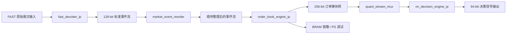

# RTL 数据路径与模块职责说明

## 1. 整体功能流图

这一条链路说明了整个 RTL 处理链：

1. FAST 采样流先进入解码器，将原始字节流还原成标准 128-bit 事件记录。
2. 事件重排模块修正同时间戳下的先后顺序，确保订单先于成交输出。
3. 订单簿引擎接收事件流并维护 bid/ask 价格水平、数量和哈希字典。
4. 订单簿快照输出给后续处理/调试，同时也可用于量化决策信号插入。
5. 选择器把快照流和信号流按优先级合并，供下一阶段逻辑使用。

---

## 2. 模块职责总览

### 2.1 FAST 解码器：fast_decoder_ip
职责：
- 接收原始 FAST/STEP 字节流。
- 识别 96= 、95=...96= 等包装格式。
- 解析出字段位图（Pmap）和字段内容。
- 输出标准 128-bit 逐笔记录：
  - order_id
  - quantity
  - price
  - timestamp
  - security_id
  - side
  - msg_type

输入/输出：
- 输入：s_axis_raw_tdata / s_axis_raw_tvalid / s_axis_raw_tlast
- 输出：m_axis_decoded_tdata / m_axis_decoded_tvalid / m_axis_decoded_tlast

核心逻辑：
- 扫描 Tag 96= 和 Pmap
- 读取字段长度/编码模式
- 按字段操作符执行 Direct / Copy / Default / Increment / Delta / Constant
- 记录 byte_count、frame_count、error_count、step_length 等统计量

用途：
- 为后续订单簿 engine 提供标准化事件输入。
- 把低层网络/协议层内容隔离出来，让上层不依赖原始 FAST 字节格式。

---

### 2.2 事件重排序器：market_event_reorder
职责：
- 修正同时间戳下事件顺序。
- 保证订单先于成交输出，避免订单簿在相同时间点上看到错误顺序。

关键规则：
- 若同一 timestamp 下出现 order + trade，优先输出 order。
- 若当前事件需要延迟处理，则暂存到 hold / follow 缓冲区。
- 在事件流中维持一个“先等待、后输出”的顺序控制。

输入/输出：
- 输入：s_axis_tdata / s_axis_tvalid / s_axis_tlast
- 输出：m_axis_tdata / m_axis_tvalid / m_axis_tlast

数据路径：
- 输入事件进入后，先检查是否存在 hold_valid 的候选事件。
- 若当前输入 event 与暂存 event 同 timestamp 且类型为 order，则先发当前 order，再放回之前 hold 的 trade。
- 这样能让下游订单簿收敛到符合市场一致性的事件流。

---

### 2.3 订单簿引擎：order_book_engine_ip
职责：
- 维护 buy / sell 订单簿状态。
- 维护 1024-entry 哈希表，用于按 order_id 查找订单。
- 维护 10 档 buy / sell price level。
- 处理新增委托、撤单、成交三类事件。
- 输出当前订单簿快照，供后续决策和调试。

核心数据结构：
- 哈希表：dict_key / dict_delta / dict_qty / dict_valid / dict_side
- 价格档位：bid_price[0:9], ask_price[0:9]
- 数量档位：bid_qty[0:9], ask_qty[0:9]

事件处理：
- 新增订单（msg_type = 1）
  - 按 order_id 哈希查找槽位
  - 若为空则插入
  - 若已存在则更新 qty / price delta
  - 更新对应 buy/ask 价格档位
- 撤单（msg_type = 2）
  - 减少对应 qty
  - 若清空则删除该订单并从档位中移除
- 成交（msg_type = 3）
  - 扣减目标订单 qty
  - 更新 last_trade_price、last_timestamp、last_security

输出：
- m_axis_snapshot_tdata：256-bit 订单簿快照
- 可同步输出给后续模块或软件查看
- 同时通过 BRAM 写出键/价格偏移镜像，供 debug 和外部监控

---

### 2.4 流选择器：quant_stream_mux
职责：
- 在两路流之间按优先级选择输出：signal 流优先，若无 signal 则输出 snapshot。
- 作用上相当于一个简化的多路复用器。

输入/输出：
- 输入：s_signal_tdata 和 s_snapshot_tdata
- 输出：m_axis_tdata

用途：
- 把订单簿快照和决策信号统一收口，供后续模块按同一 AXIS 接口处理。
- 便于后续在 FPGA 侧做更高层的策略/决策合成。

---

### 2.5 决策引擎壳层：nn_decision_engine_ip
职责：
- 接收特征流。
- 生成固定格式的 64-bit 决策输出信号。
- 当前版本是占位实现，后续可以替换成真正的 HLS/RTL CNN 或量化 NN。

输入/输出：
- 输入：s_axis_feat_tdata / s_axis_feat_tvalid / s_axis_feat_tlast
- 输出：m_axis_signal_tdata / m_axis_signal_tvalid / m_axis_signal_tlast

当前输出格式：
- 64-bit 固定格式示例：
  - type
  - confidence
  - target price
  - quantity

用途：
- 为后续 AI/ML 决策逻辑预留接口，保证上层数据接口稳定。

---

## 3. 标准记录格式

逐笔记录（128 bit）定义：

[127:96] order_id | [95:80] quantity | [79:48] price | [47:16] timestamp | [15:8] security_id | [7:4] side | [3:0] msg_type

说明：
- msg_type = 1：新增订单
- msg_type = 2：撤单
- msg_type = 3：成交
- side = 0：买
- side = 1：卖

---

## 4. 订单簿快照格式（256 bit）

输出快照中，一般包含：

- timestamp
- trade_price
- ask_qty / ask_price
- bid_qty / bid_price
- security_id
- msg_type
- side
- padding / flags

其语义上说明：
- 这不是原始交易事件，而是当前订单簿状态压缩后的“快照”。
- 后续决策模块可直接使用这些数值，不需再反推订单簿内部结构。

---

## 5. 数据链路总结

最终从协议层到策略层的数据链路可以概括为：

FAST 报文 -> FAST 解码 -> 事件重排 -> 订单簿维护 -> 订单簿快照 -> 选择器 -> 决策输出

这条链路的设计目标是：
- 把底层字节解析和高层交易逻辑解耦；
- 保证事件顺序逻辑正确；
- 让订单簿状态可观测、可调试、可扩展；
- 给后续 AI 决策算法提供稳定数据接口。

---

## 6. 代码组织建议

当前 RTL 目录中，各模块职责清晰，建议后续保持以下规则：

- 每个模块顶部保留 1~2 段中文说明
- 每个状态机段落写清输入、输出和状态转换逻辑
- 对外接口使用固定命名约定：s_axis_* / m_axis_* / s_axi_ctrl_*
- 不要在模块中混用中文注释和过度不规范的压缩编码风格

这样后续维护者可以直接从 README 和模块注释中快速定位：
- 数据来自哪里
- 怎么用
- 输出去哪
- 该模块属于哪一层

---

## 7. HLS vs RTL 对照表

下面给出 HLS 原型与 RTL 实现的一一对应关系，便于对照 FPGA 实现和高层原型。

| 功能层级 | HLS 文件 | RTL 文件 | 对应职责 |
| --- | --- | --- | --- |
| 协议解码 | [../hls/fast_decoder_hls.cpp](../hls/fast_decoder_hls.cpp) | [fast_decoder_ip.v](fast_decoder_ip.v) | 解析 FAST/STEP 原始报文，输出标准 128-bit 事件记录 |
| 事件重排 | - | [market_event_reorder.v](market_event_reorder.v) | 校正同 timestamp 下订单与成交输出顺序 |
| 订单簿状态维护 | [../hls/order_book_hls.cpp](../hls/order_book_hls.cpp) | [order_book_engine_ip.v](order_book_engine_ip.v) | 管理哈希表、价格档位和数量，处理下单/撤单/成交 |
| 流选择 | - | [quant_stream_mux.v](quant_stream_mux.v) | 在 snapshot 和 signal 两条流之间做 MUX 选择 |
| 决策接口 | - | [nn_decision_engine_ip.v](nn_decision_engine_ip.v) | 量化 NN / 决策信号接口壳层 |

### 7.1 FAST 解码对应关系

| HLS 结构 / 逻辑 | RTL 对应项 | 说明 |
| --- | --- | --- |
| `RawBeat`、`DecodedRecord` | `s_axis_raw_tdata`、`m_axis_decoded_tdata` | 输入原始字节流，输出标准订单记录 |
| `stopbit_merge()` | `var_acc` / `var_len` / `cbyte` | 用 stop-bit 方式恢复字段值 |
| `sign_extend()` | `merged_value` / `decoded_val` | 处理 Delta / 有符号扩展 |
| `previous[]` | `prev_price` / `prev_qty` / `prev_order` / `prev_time` / `prev_sec` / `prev_side` / `prev_type` | 记录历史字段值，供 Copy / Delta / Increment 使用 |
| `field_op[]` / `uses_pmap[]` | `control_reg` 中的字段配置 | 控制字段解码方式和 Pmap 触发条件 |

### 7.2 订单簿对应关系

| HLS 结构 / 逻辑 | RTL 对应项 | 说明 |
| --- | --- | --- |
| `OrderSlot dict[1024]` | `dict_key[]` / `dict_delta[]` / `dict_qty[]` / `dict_valid[]` / `dict_side[]` | 订单哈希字典 |
| `find_order()` | `probe_idx` / `probe_count` / `lookup_found` | 根据 order_id 做探测定位 |
| `bid_price[] / ask_price[]` | `bid_price[] / ask_price[]` | 买卖价格档位 |
| `bid_qty[] / ask_qty[]` | `bid_qty[] / ask_qty[]` | 买卖数量档位 |
| `remove_level()` | `for (i=j; i<LEVELS-1; i=i+1)` 移动逻辑 | 清空档位时前移后续层级 |
| `L2Snapshot` | `m_axis_snapshot_tdata` | 输出订单簿快照 |

### 7.3 设计视角上的差异

- HLS 版本更接近“算法原型”，代码更短、更易验证逻辑正确性。
- RTL 版本更接近“可综合硬件实现”，加入状态机、握手、AXI-Lite 控制、BRAM 接口和输出控制。
- 两者的功能语义一致：
  - 接收原始 FAST 字节流
  - 标准化订单记录
  - 维护订单簿状态
  - 生成 snapshot / signal 输出

### 7.4 建议的开发方式

1. 用 HLS 版本先验证算法正确性，尤其是 stop-bit 解码和哈希更新逻辑。
2. 再用 RTL 版本对照实现，确保最终硬件数据路径与算法语义一致。
3. 在调试时，优先比对：
   - 解码后的记录格式是否一致
   - 订单插入/删除是否更新同一套 dict / price level
   - snapshot 输出字段顺序是否一致

这样可以快速定位“算法层逻辑正确但 RTL 微妙实现漂移”的问题。